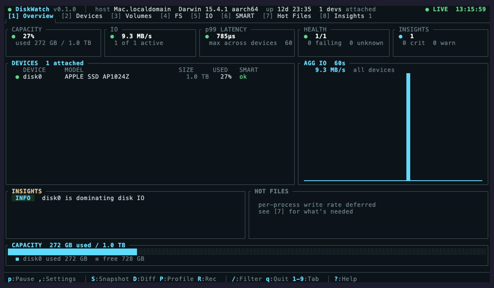

<p align="center">
  <h1 align="center">DiskWatch</h1>
  <p align="center">
    <strong>Single-host disk diagnostics in your terminal. The terminal you open when the disk light won't stop blinking — before you reach for iostat, iotop, smartctl, lsblk, df, du, and a panic.</strong>
  </p>
  <p align="center">
    
    
    
  </p>
</p>

<p align="center">
  <em>Sibling to <a href="https://github.com/matthart1983/netwatch">NetWatch</a> and <a href="https://github.com/matthart1983/syswatch">SysWatch</a>. Same chrome. Same palette. Eight tabs covering every disk on one box.</em>
</p>

<p align="center">
  
</p>

---

## What it shows

| # | Tab | Replaces |
|---|---|---|
| 1 | Overview | one screen across capacity, IO, health, hot files |
| 2 | Devices | `lsblk`, `nvme list`, `diskutil list`, `hdparm -I` |
| 3 | Volumes | `lvs` + `vgs`, `mdadm --detail`, `diskutil apfs list` |
| 4 | FS | `df -h`, `df -i`, `mount`, `findmnt` |
| 5 | IO | `iostat -x 1`, biolatency-style averages |
| 6 | SMART | `smartctl -A`, `nvme smart-log` |
| 7 | Hot Files | `fanotify`/`fseventsd` watcher (paths, not bytes) |
| 8 | Insights | plain-English anomaly summaries |

Where `lsblk` shows you *which disks exist*, DiskWatch shows you *what's happening on them* — capacity trending, IO throughput, p99 latency, SMART health, and the files being written *right now* — and tells you why in plain English when something's anomalous.

## Install

```bash
git clone https://github.com/matthart1983/diskwatch.git && cd diskwatch
cargo build --release
./target/release/diskwatch
```

Or from crates.io:

```bash
cargo install diskwatch
```

**Prerequisites:** Rust 1.75+. No system dependencies on Linux. macOS calls the standard `ioreg`, `diskutil`, and `system_profiler` binaries — all preinstalled. Optional: `smartmontools` (`brew install smartmontools` / `apt install smartmontools`) for full SMART attribute tables — without it, the SMART tab falls back to the basic verified/failing flag from `diskutil`.

## Keys

| Key | Action |
|---|---|
| `1`–`8` | Switch tabs |
| `↑` / `↓` / `j` / `k` | Move selection (Devices, FS) |
| `p` | Pause / resume sampling |
| `q` / `Esc` | Quit |
| `--diag` | Print collected state and exit (no TUI) |

## Tabs in detail

**[1] Overview** — 5 KPI tiles (capacity, IO, p99 latency, health, insights), per-device summary, aggregate IO sparkline, top insights, segmented capacity bar.

**[2] Devices** — block-device table with model, firmware, serial, used %, SMART status. Detail panel for the selected device.

**[3] Volumes** — APFS containers (macOS) with nested volumes, role, mount, FileVault. mdraid arrays (Linux) with members, slot state `[UUUU]`, resync/recovery progress.

**[4] FS** — mounted filesystems with inline usage bars, threshold colors, system/user/removable classification.

**[5] IO** — per-device read / write throughput, 48s sparkline, p50 + p99 latency (read and write) over a 60s rolling window.

**[6] SMART** — full NVMe / ATA attribute tables when `smartctl` is on PATH; degraded banner with install instructions when not. Always shows the basic verified/failing flag.

**[7] Hot Files** — paths by event rate via FSEvents (macOS) / inotify (Linux). Honest footer: this tab can't show bytes/sec or process attribution without root (`fs_usage`) / Endpoint Security entitlement / eBPF biosnoop.

**[8] Insights** — anomaly cards over the collected state: capacity warnings, SMART failures, NVMe wear, drive temperature, p99 latency outliers, IO-dominant devices, hot-file runaway, removable drives.

## What's real, what's deferred

| Metric | macOS | Linux |
|---|---|---|
| Device model / serial / firmware | ✅ `system_profiler` + IOKit | ✅ `/sys/block/*/device/{model,serial,firmware_rev}` |
| Per-device used bytes | ✅ via APFS container map | ✅ summed from `sysinfo` mounts |
| Read/write byte rates (split) | ✅ IOKit `Statistics` | ✅ `/proc/diskstats` cols 5/9 |
| Avg per-op latency | ✅ `Total Time / Operations` | ✅ `/proc/diskstats` cols 6/10 |
| p50 / p99 latency | ✅ tick-averaged over 60s | ✅ tick-averaged over 60s |
| True per-op p99 (histogram) | ❌ needs IOReport entitlement | ❌ needs eBPF biolatency (CAP_BPF) |
| SMART attributes | ✅ `smartctl` if installed | ✅ `smartctl` if installed |
| Volumes — APFS | ✅ `diskutil apfs list` | n/a |
| Volumes — mdraid | n/a | ✅ `/proc/mdstat` |
| Volumes — ZFS, LVM | ⏳ deferred | ⏳ deferred |
| Hot files (paths) | ✅ FSEvents | ✅ inotify |
| Hot files — bytes / pid | ❌ needs root `fs_usage` / entitlement | ❌ needs eBPF biosnoop |

## Design

Inherits the *Watch family chrome — `#0c1418` background, terminal-green accent, JetBrains Mono, 130×36 character grid with responsive reflow ≥ 110×30. The same character-grid mockups that drive NetWatch and SysWatch drive DiskWatch.

## Anti-goals

- **Not multi-host.** Use NetWatch Cloud if you need a fleet view.
- **Not a daemon.** No long-running collector, no persisted DB.
- **Not a deduper / cleaner.** We surface what's eating disk; we don't delete anything. Mutation is a different tool.
- **Not a backup product.** Snapshots are observed, not authored.
- **Not a benchmark.** We measure what's happening, not what's possible.

## License

MIT.
